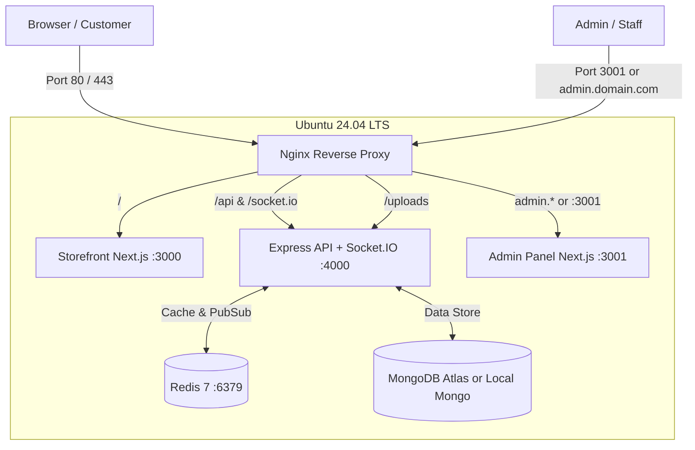

# 🚀 Complete AWS EC2 Deployment Guide — Dev Creation Platform

This guide provides the complete, battle-tested blueprint to launch, configure, deploy, and maintain the **Dev Creation** e-commerce platform on Amazon Web Services (AWS) EC2.

---

## 📋 Architecture Overview

The production deployment runs in isolated Docker containers managed by Docker Compose and reverse-proxied by Nginx:



---

## 1. ⚙️ Recommended EC2 Specifications

| Component | Recommendation | Why |
| :--- | :--- | :--- |
| **Instance Type** | **`t3.medium`** (2 vCPU, 4 GB RAM) | Required for comfortable Next.js standalone execution, Redis, API, and build operations. |
| *Alternative* | `t3.small` (2 vCPU, 2 GB RAM) | Only if using **MongoDB Atlas** (Cloud) and 2GB Swap enabled. |
| **Operating System** | **Ubuntu 24.04 LTS** (64-bit x86) | Long-term support, stable Linux kernel, modern package ecosystem. |
| **Storage (EBS)** | **30 GB gp3 SSD** | Provides high IOPS (3000) and throughput (125 MB/s) with ample room for images and logs. |
| **Public IP** | **AWS Elastic IP** | Static IPv4 that will never change when the EC2 instance is stopped or restarted. |

---

## 2. 🛡️ AWS Security Group Configuration

When launching your instance or in **EC2 > Security Groups**, create a Security Group named `devcreation-sg` with the following rules:

### Inbound Rules (Traffic allowed INTO EC2)

| Type | Port Range | Protocol | Source | Purpose |
| :--- | :--- | :--- | :--- | :--- |
| **SSH** | `22` | TCP | `My IP` (or `0.0.0.0/0`) | Secure terminal access |
| **HTTP** | `80` | TCP | `0.0.0.0/0` | Web traffic (Storefront & API) |
| **HTTPS** | `443` | TCP | `0.0.0.0/0` | Encrypted SSL/TLS traffic |
| **Custom TCP** | `3001` | TCP | `0.0.0.0/0` | Direct Admin Panel access (before domain setup) |

### Outbound Rules (Traffic allowed OUT from EC2)

| Type | Port Range | Protocol | Destination | Purpose |
| :--- | :--- | :--- | :--- | :--- |
| **All traffic** | All | All | `0.0.0.0/0` | MongoDB Atlas, npm packages, Docker Hub |

---

## 3. 🖥️ Launching the EC2 Instance (Step-by-Step)

1. Log into your [AWS Management Console](https://console.aws.amazon.com/).
2. Navigate to **EC2** and click **Launch instance**.
3. **Name**: `DevCreation-Production`
4. **Application and OS Images**: Select **Ubuntu Server 24.04 LTS (HVM)**.
5. **Instance type**: Select **`t3.medium`**.
6. **Key pair (login)**:
   - Select an existing key pair or click **Create new key pair**.
   - Type: `RSA`, format: `.pem` (for Mac/Linux/OpenSSH) or `.ppk` (for PuTTY).
   - Save the downloaded file (e.g., `devcreation-key.pem`).
7. **Network settings**:
   - Check **Allow SSH traffic from Anywhere** (or My IP).
   - Check **Allow HTTP traffic from the internet**.
   - Check **Allow HTTPS traffic from the internet**.
   - Add rule for custom TCP port `3001`.
8. **Configure storage**: Change `8 GiB` to **`30 GiB`** gp3.
9. Click **Launch instance**.
10. *(Recommended)* Go to **EC2 > Network & Security > Elastic IPs**, click **Allocate Elastic IP**, then select it and choose **Actions > Associate Elastic IP address** to attach it to your new EC2 instance.

---

## 4. 🔑 Connecting to Your EC2 Instance

Open your local terminal (PowerShell, Command Prompt, or bash) and navigate to where you saved your `.pem` key:

```bash
# On Linux / Mac:
chmod 400 devcreation-key.pem
ssh -i "devcreation-key.pem" ubuntu@<YOUR-EC2-PUBLIC-IP>

# On Windows PowerShell:
ssh -i "devcreation-key.pem" ubuntu@<YOUR-EC2-PUBLIC-IP>
```

---

## 5. ⚡ Automated EC2 Setup & Provisioning

Once connected to your EC2 instance, run the automated provisioning script. It automatically:
- Updates all Ubuntu packages
- Sets up **2GB Swap space** (prevents memory exhaustion)
- Installs Docker Engine, Docker Buildx, and Docker Compose v2
- Configures the UFW firewall
- Installs Certbot for SSL

### Run Setup:

```bash
# Clone the repository
git clone https://github.com/ashishpimple94/Devcreation1.git
cd Devcreation1

# Make scripts executable
chmod +x ec2-setup.sh deploy.sh

# Run the system setup (as root)
sudo ./ec2-setup.sh

# Refresh your user permissions so docker commands work without sudo
newgrp docker
```

---

## 6. ⚙️ Configure Production Environment

Copy the production environment template:

```bash
cp .env.production.example .env.production
nano .env.production
```

### Essential Values to Configure:

1. **`MONGODB_URI`**:
   - **MongoDB Atlas (Recommended)**: Paste your Atlas connection string:
     ```ini
     MONGODB_URI=mongodb+srv://<username>:<password>@cluster0.ezzkjmw.mongodb.net/dev_creation?retryWrites=true&w=majority
     ```
   - **Local Docker MongoDB**: If you don't have Atlas, keep the default:
     ```ini
     MONGODB_URI=mongodb://mongo:27017/dev_creation
     ```

2. **`JWT_ACCESS_SECRET` & `JWT_REFRESH_SECRET`**:
   Generate secure 64-character keys:
   ```bash
   openssl rand -hex 32
   ```
   Paste them into `.env.production`.

3. **`PUBLIC_ASSET_BASE`**:
   Set this to your public EC2 IP (or domain once mapped):
   ```ini
   PUBLIC_ASSET_BASE=http://<YOUR-EC2-PUBLIC-IP>
   ```

4. **`NEXT_PUBLIC_ADMIN_URL` & `STORE_URL`**:
   ```ini
   NEXT_PUBLIC_ADMIN_URL=http://<YOUR-EC2-PUBLIC-IP>:3001
   STORE_URL=http://<YOUR-EC2-PUBLIC-IP>
   ```

*Save and exit in nano:* Press `Ctrl + O`, then `Enter`, then `Ctrl + X`.

---

## 7. 🚀 Deploy & Seed Application

Run the deployment script with the `--seed` flag. This will:
1. Build the multi-stage Docker images (`backend`, `frontend`, `admin`, `nginx`, `redis`).
2. Start all services in the background.
3. Automatically seed initial product categories, catalog items, and create the default super admin account.

```bash
./deploy.sh --seed
```

### 🎉 Verify Services:

Check running containers:
```bash
docker compose -f docker-compose.prod.yml ps
```

You will see:
- `devcreation_nginx` (running on ports 80, 443, 3001)
- `devcreation_frontend` (healthy on internal port 3000)
- `devcreation_admin` (healthy on internal port 3001)
- `devcreation_backend` (healthy on internal port 4000)
- `devcreation_redis` (healthy on internal port 6379)
- `devcreation_mongo` (healthy on internal port 27017)

### 🌐 Test in Your Web Browser:
- **Customer Storefront**: `http://<YOUR-EC2-PUBLIC-IP>`
- **Admin Panel**: `http://<YOUR-EC2-PUBLIC-IP>:3001`
- **Backend API Health**: `http://<YOUR-EC2-PUBLIC-IP>/api/health`

### 🔑 Default Seeded Admin Login:
- **Email**: `admin@devcreation.com` (or the email specified in `.env.production`)
- **Password**: `ChangeMeStrongPassword123!` (or the password in `.env.production`)

---

## 8. 🔒 Connecting a Custom Domain & Free SSL (Certbot)

When you are ready to point your custom domain (e.g. `yourdomain.com`):

### Step A: Configure DNS A Records
In your domain registrar (GoDaddy, Namecheap, Cloudflare, Route53, etc.):
- **Type**: `A` | **Host**: `@` | **Points to**: `<YOUR-EC2-PUBLIC-IP>`
- **Type**: `A` | **Host**: `www` | **Points to**: `<YOUR-EC2-PUBLIC-IP>`
- **Type**: `A` | **Host**: `admin` | **Points to**: `<YOUR-EC2-PUBLIC-IP>`

### Step B: Generate Free Let's Encrypt SSL
Run Certbot using the shared Docker webroot:

```bash
sudo certbot certonly --webroot \
  -w /var/lib/docker/volumes/devcreation1_certbot_webroot/_data \
  -d yourdomain.com -d www.yourdomain.com -d admin.yourdomain.com
```

### Step C: Activate SSL in Nginx
1. Edit `docker/nginx/ssl.conf.template` and replace `yourdomain.com` with your actual domain.
2. Copy it into the active Nginx configuration:
   ```bash
   cp docker/nginx/ssl.conf.template docker/nginx/default.conf
   ```
3. Update `.env.production` URLs:
   ```ini
   PUBLIC_ASSET_BASE=https://yourdomain.com
   NEXT_PUBLIC_ADMIN_URL=https://admin.yourdomain.com
   STORE_URL=https://yourdomain.com
   ```
4. Reload Nginx without downtime:
   ```bash
   docker compose -f docker-compose.prod.yml restart nginx
   ```

---

## 9. 🛠️ Routine Maintenance & Commands

| Task | Command |
| :--- | :--- |
| **View Live Container Logs** | `docker compose -f docker-compose.prod.yml logs -f` |
| **View API Logs Only** | `docker compose -f docker-compose.prod.yml logs -f backend` |
| **Check Resource / Memory Usage** | `docker stats` |
| **Deploy Latest Code Updates** | `./deploy.sh` |
| **Restart All Containers** | `docker compose -f docker-compose.prod.yml restart` |
| **Stop All Containers** | `docker compose -f docker-compose.prod.yml down` |
| **Re-run Database Seed** | `docker compose -f docker-compose.prod.yml exec backend npm run seed:prod` |
| **Clean Up Disk Space** | `docker system prune -af` |

---

## 10. 🚨 Troubleshooting Common Issues

### Issue 1: Cannot connect to EC2 via SSH
- Ensure your Security Group has Inbound Port 22 open.
- Verify your `.pem` key has strict permissions (`chmod 400 your-key.pem`).
- Ensure you are logging in with user `ubuntu` (e.g. `ssh -i key.pem ubuntu@ip`).

### Issue 2: MongoDB connection times out
- If using MongoDB Atlas, make sure **Network Access** in MongoDB Atlas allows `0.0.0.0/0` (or your EC2 Elastic IP).
- Check that the username and password in `MONGODB_URI` are URL-encoded if they contain special characters.

### Issue 3: Container crashes due to memory
- Verify swap is active by running `free -m`. You should see `2047` in the Swap row. If not, re-run Step 2 of `ec2-setup.sh`.
